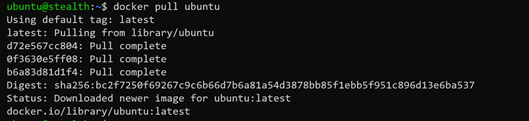
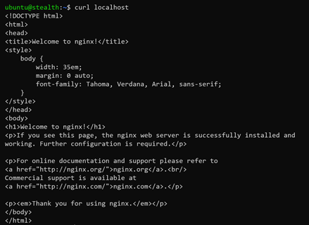
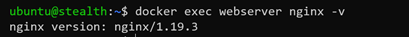
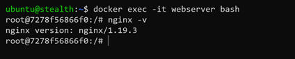
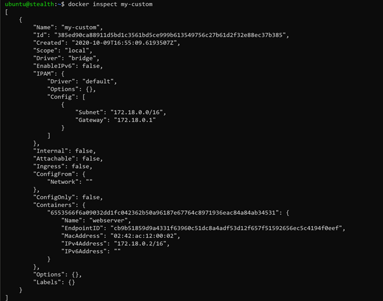
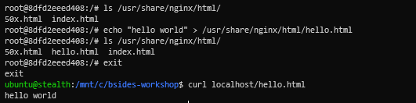
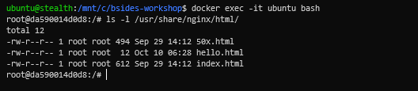
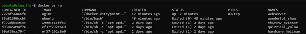
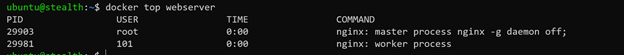
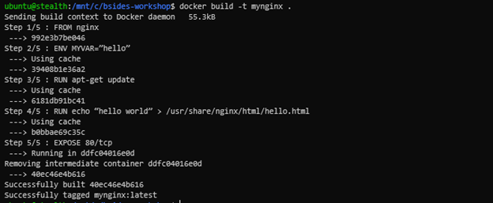

# bsides-workshop

In this workshop we will cover some basic of docker command such as:
- docker pull
- docker run
- docker exec
- docker network
- docker volume
- docker ps
- docker top
- docker build

### docker pull
Pull is an argument to download the docker image from the docker registry, its similar to git repository but to saving our image into the compressed file. By default, the docker command will pull the image from DockerHub, but you can also use other platforms like Quay, GitLab Container Registry, GitHub Container Registry, and so on.  When you do a pull, basically the image will use the **latest** tag for example:

```
$ docker pull ubuntu
``` 



When you execute the above command, you will get an output process of pulling if you want to hide the output, you can add the extra argument like **--quiet** or **-q**.

```
$ docker pull ubuntu -q
```

Then, you can also download all of the image tags using the following argument.

```
$ docker pull ubuntu -a
```

### docker run

Run is an argument to starting a container from the docker image, there is a lot of options that we can use such as given a name to the container also bind container port to host, and so on. For example, we will run the container on the background and give it a name, 

```
$ docker run -d –name example ubuntu
```

The container will be starting in the background, but if you see the list containers with **docker ps** you can’t find the container with that name. Why?
Because there is no process attach to the container so it will show **exited** status, to keep it the container run we can add an argument like **--interactive** / **-i** 

```
$ docker run -d –name example -i ubuntu
```

You will see the container keep running, compared with the previous command you run. Then, if you run this command it will tell us about container conflict with the name because we use the same name, how to fix this? You can run **docker rm** to remove the previous container.

```
$ docker rm example
```

Then execute the previous command again, voila! now a container at a running state and you can verify again with **docker ps**. Next, we want to run a webserver using Nginx with port binding to the host. First, you need to pull the Nginx image then you can run the container with a port argument to binding the port from the container into the host.

```
$ docker pull nginx
$ docker run -d --name webserver -p 80:80 -I nginx
```

Or you don’t need to pull the image because run argument will verify the image in the local then if the image doesn’t exist it will pull from the registry. Now you can do a request to your localhost with curl command to see the container is running a web server.

```
$ curl localhost
```


 
You have successfully run a web server using a docker container!

When the container running, it will use all resources of the system if you didn’t add the limit like CPU or Memory which will be used. In this case, we can use the following command to limit the resource in the container.

```
$ docker run -d --name webserver --cpus 0.1 -m 100m -I nginx
```

**--cpus**: Number of CPUs to used in the container, you can give the value like 0.1, 0.5, 1 and so on it based on you CPUs count
**-m**: Memory limit to use in the container, you can give the value to **1000k**, **100m**, **1g**.

### docker exec

Exec is an argument to execute the command inside of containers or used to get the shell in the containers.

```
$ docker exec webserver nginx -v
```


 
Or enter a shell in containers.

```
$ docker exec -it webserver bash
```



### Network

Docker container has the capabilities to create a network with some drivers like **host**, **bridge**, **macvlan**, **overlay**, and **none** by default but it's possible to add another network plugins like weave2, etc. If you run the containers, by default it will use **bridge** as the network but you can also create another network with a custom name and attach it to your container.

```
$ docker network create my-custom
$ docker run -d --name webserver --network my-custom -p 80:80 -i nginx
```

To see the available docker network, use the following command:

```
$ docker network ls
```

Or you want to get some information about your network, use the **docker inspect** command.

```
$ docker inspect my-custom
``` 



### Volume

Volume is a command to create a volume that the container used to store data because docker is immutable then we need to use the volume or build the image repeated if have any changes in the container and docker volume have a driver that we can use to define a volume like local, brtfs, nfs, etc. In this section, we will create a new volume and attach it to containers then verify the file is storing in volume when we removing or stopping the container.

```
$ docker volume create data
$ docker run -d --name webserver -p 80:80 -v data:/usr/share/nginx/html -i nginx
$ docker exec -it webserver bash
```

Then create an html file for example to display “hello world”.

```
$ echo “hello world” > /usr/share/nginx/html/hello.html
```



Exit from the container and do a curl command to get the output of the new file. Then, remove the running container using `docker rm` command:

```
$ docker rm webserver
```

Create another container that assigns the previous volume for example.

```
$ docker run -d --name ubuntu -v data:/usr/share/nginx/html -i ubuntu
``` 



### docker ps

Ps is an argument to list containers with some options like filter output to list created containers, running, exited, or stopped, and so on. For example:

```
$ docker ps -a
```

 

Will show an output of all of containers status included, exited, or stopped.

### docker top
Top is an argument to display the running process of a container similar to the **htop** command.

```
$ docker top webserver
 ```



### Build
You’ve done to learn the basics how to operate docker using CLI, now we will create our custom docker image by creating Dockerfile.

```
$ nano Dockerfile
FROM nginx
ENV MYVAR=”hello”
RUN apt-get update 
RUN echo “hello world” > /usr/share/nginx/html/hello.html
EXPOSE 80/tcp
``` 



We’ve successfully built the image, so we can run the image using the docker run command.

```
$ docker run -d –name mynginx -p 80:80 -I mynginx
```

You will figure the **hello.html** file added to the container.

